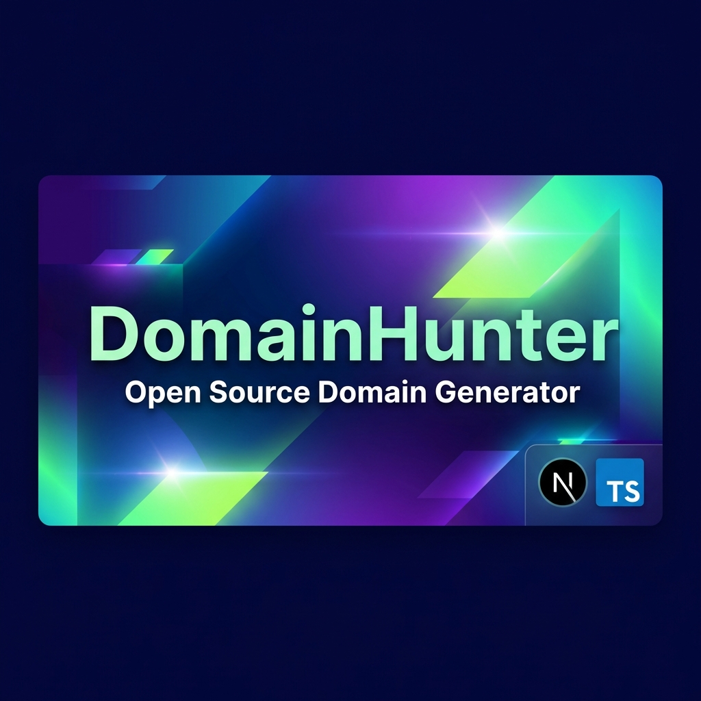
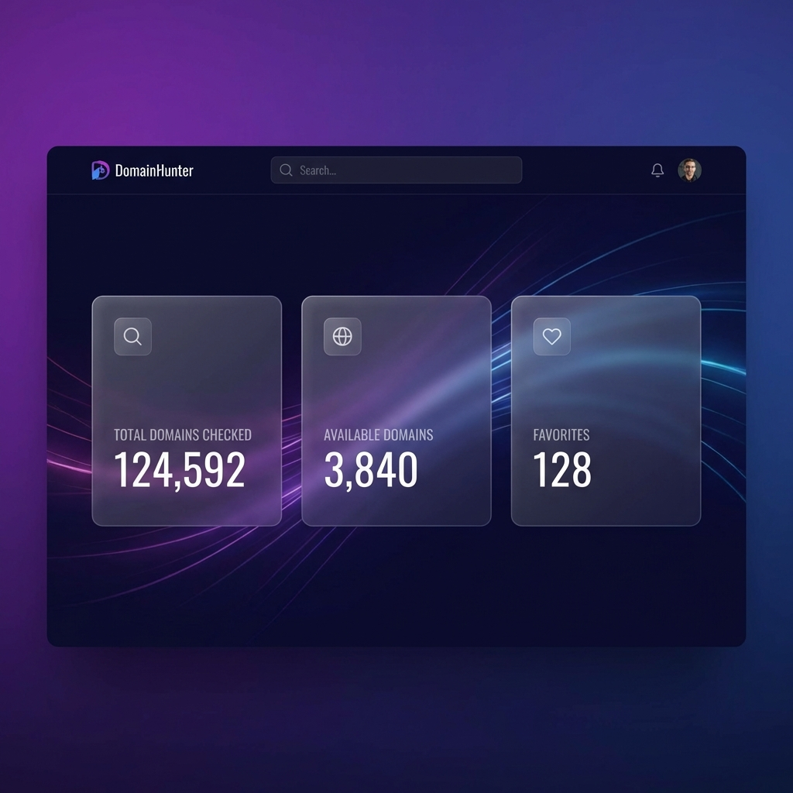
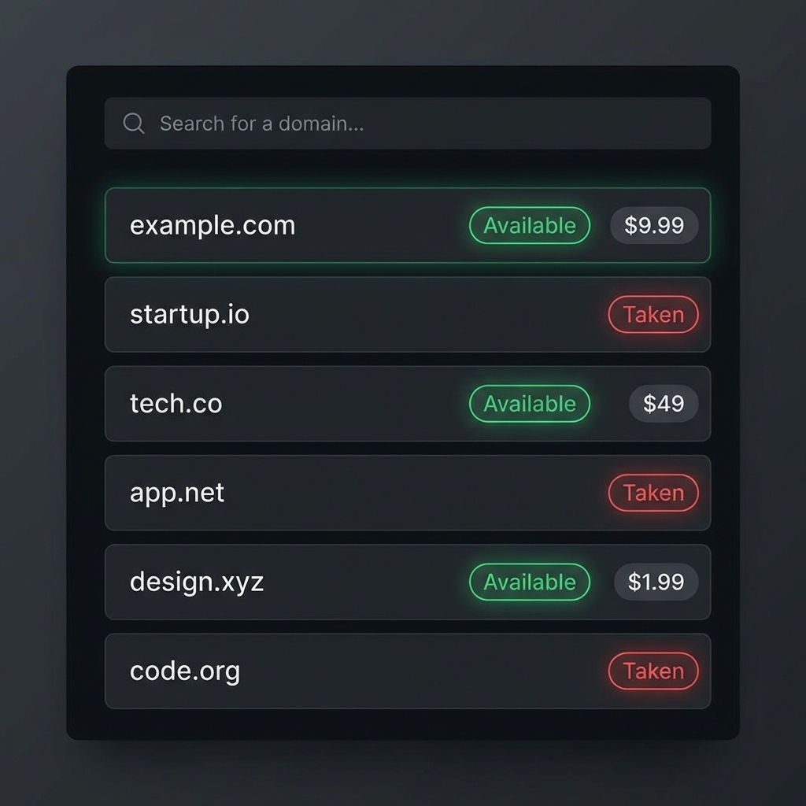
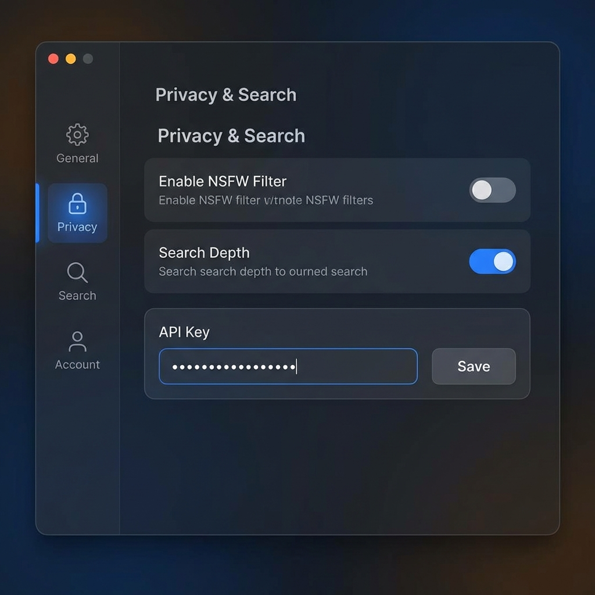
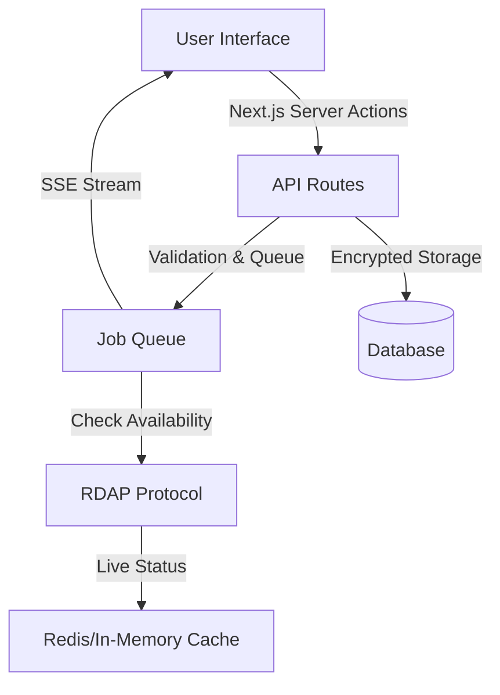

# DomainHunter

<div align="center">
  

  <br />
  <br />

  [](https://nextjs.org/)
  [](https://www.typescriptlang.org/)
  [](LICENSE)
  [](https://github.com/fadyy2k/Domain-Hunter)
  [](https://github.com/fadyy2k/Domain-Hunter/actions)

  <h3 align="center">Smart Domain Name Generator & Availability Checker</h3>

  <p align="center">
    Open-source tool with advanced phonetic generation, high-performance SSE availability streaming, and secure local vault.
    <br />
    <a href="https://github.com/fadyy2k/Domain-Hunter/issues">Report Bug</a>
    ·
    <a href="https://github.com/fadyy2k/Domain-Hunter/issues">Request Feature</a>
  </p>
</div>

---

## 🚀 Why DomainHunter?

Finding the perfect domain name is hard. Most generators are slow, cluttered, or hide the best results behind paywalls.

**DomainHunter** is different. It's a professional **open-source application** designed for speed and privacy.
-   **Zero tracking**: Your ideas stay on your machine.
-   **Real-time**: Checks availability instantly via Server-Sent Events (SSE).
-   **Smart**: Uses linguistic algorithms (syllable mixing, phonetic matching) to invent brandable names.

## ✨ Features

-   🧠 **Smart Generation Engine**: phonetic patterns, compound words, and startup-style naming.
-   ⚡ **Bulk Availability Checking**: High-concurrency RDAP checking with real-time SSE streaming.
-   📊 **Virtualized Results**: Smoothly handle lists of 5,000+ domains without lag.
-   🔐 **Secure Vault**: Client-side AES-256 encryption for your registrar API keys (Namecheap/GoDaddy).
-   🎨 **Premium UI**: Beautiful dark mode interface with glassmorphism and smooth animations.
-   🐳 **Self-Hostable**: Deployment ready with Docker, PM2, and Nginx.

## 📸 Screenshots

### Dashboard


### Real-time Results


### Settings & Vault


## 🏗 Architecture



## 🚀 Quick Start

### Prerequisites
-   Node.js 18+
-   npm 9+

### Installation

```bash
# Clone the repository
git clone https://github.com/fadyy2k/Domain-Hunter.git
cd Domain-Hunter

# Install dependencies
npm ci

# Initialize database
npx prisma generate
npx prisma db push

# Start development server
npm run dev
```

Visit `http://localhost:3000` to start hunting!

## 🔌 API Reference

| Endpoint | Method | Description |
| :--- | :--- | :--- |
| `/api/generate` | `POST` | Generate domain suggestions based on keywords and strategy. |
| `/api/check` | `POST` | Check availability for a list of domains (Streaming SSE). |
| `/api/projects` | `GET` | Retrieve saved projects and history. |
| `/api/keys` | `POST` | Securely store encrypted registrar API keys. |
| `/api/health` | `GET` | System health and status check. |

## 🐳 Deployment

DomainHunter is production-ready.

### Docker
```bash
docker-compose up -d --build
```

### PM2 (VPS)
```bash
npm run build
pm2 start ecosystem.config.js
```

### Nginx Configuration
Ensure SSE streaming is supported by disabling buffering:
```nginx
location /api/check {
    proxy_buffering off;
    proxy_cache off;
    proxy_set_header Connection '';
    proxy_http_version 1.1;
    chunked_transfer_encoding off;
}
```

## 🔐 Security

-   **Encryption**: API keys are encrypted with `AES-256-GCM`.
-   **Environment**: No secrets are hardcoded. Use `.env` for configuration.
-   **Privacy**: This is an open-source tool. You own your data.

## 🤝 Contributing

Contributions are what make the open source community such an amazing place to learn, inspire, and create. Any contributions you make are **greatly appreciated**.

See [CONTRIBUTING.md](CONTRIBUTING.md) for detailed guidelines.

## ⭐ Open Source

This project is open-source and free to use.
If you find it useful, please consider giving it a star on GitHub! ⭐️

## License
Distributed under the MIT License. See `LICENSE` for more information.
